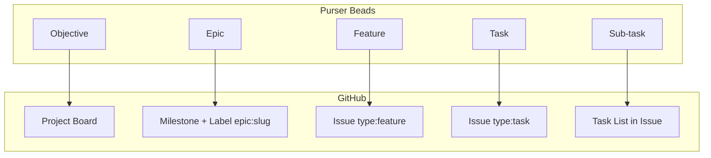
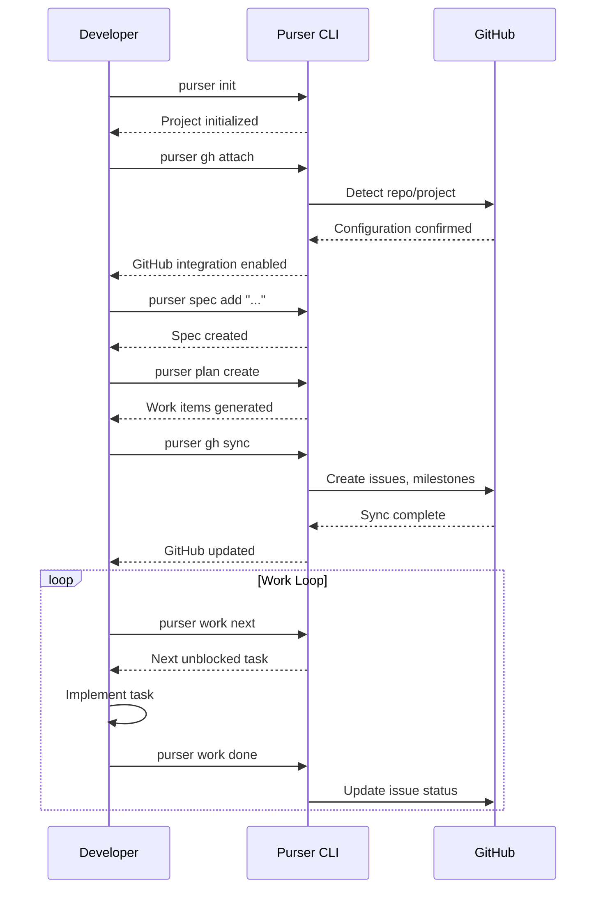
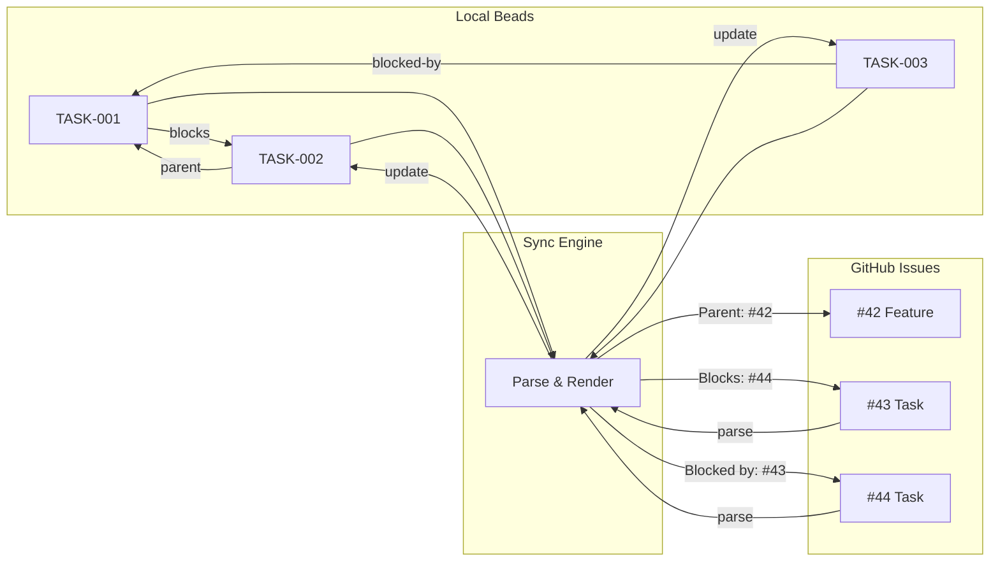
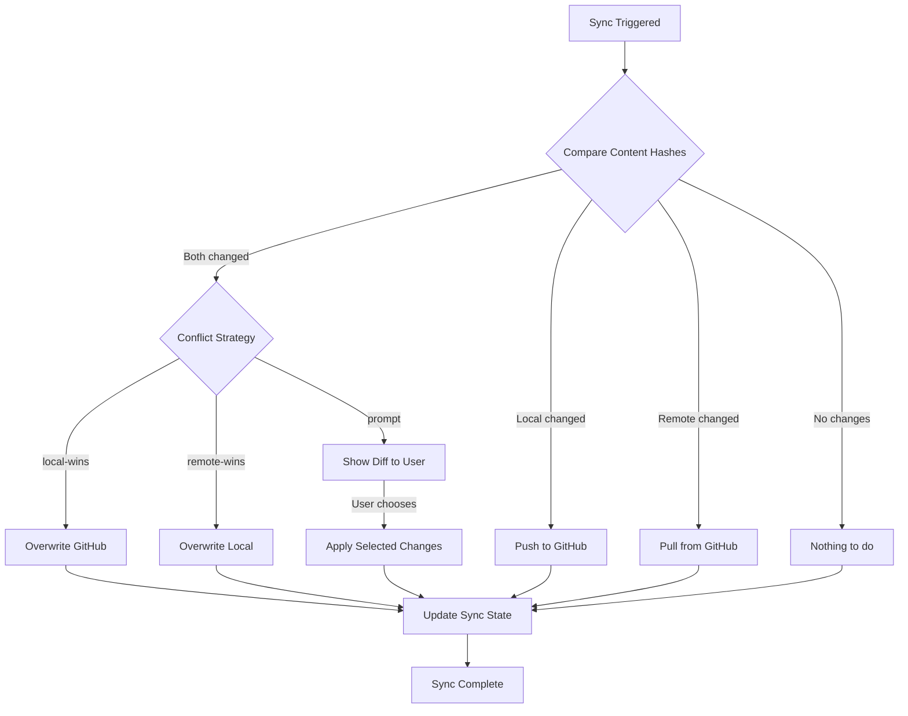
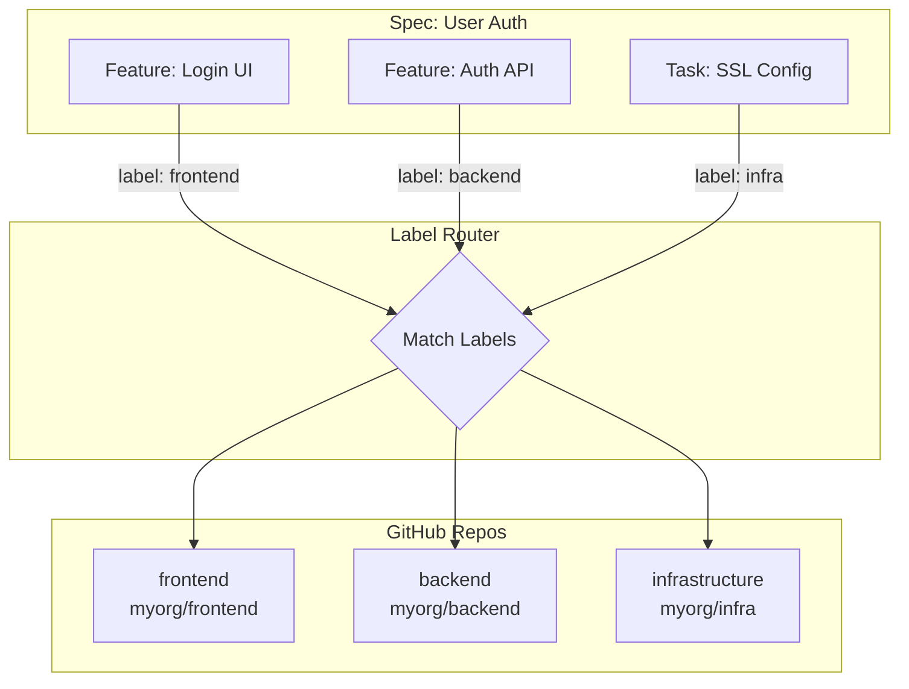
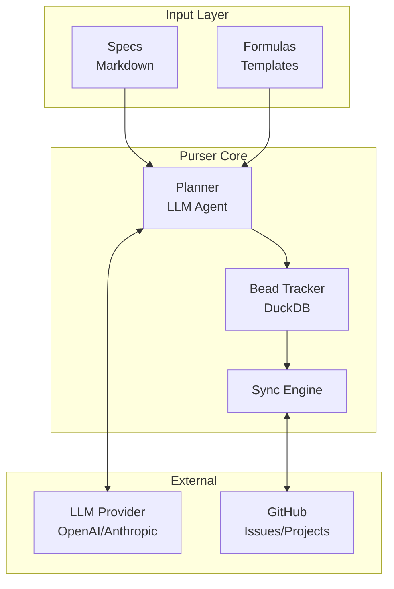

# Purser Framework Documentation: Setup Guide and GitHub Integration

## Overview

Purser is an agent-agnostic project management framework designed for AI-assisted development workflows. It combines a hierarchical work tracking system called **Beads** with persistent memory through DuckDB, enabling long-running, context-rich project management that works across different AI agents and sessions.

## Core Concepts

### Beads: The Work Hierarchy

Purser organizes work into a 5-level hierarchy called **Beads**:

| Level | Name | Description | Example |
|-------|------|-------------|---------|
| 1 | **Objective** | Strategic goal or outcome | "Launch v2.0 Platform" |
| 2 | **Epic** | Large initiative comprising multiple features | "Authentication System" |
| 3 | **Feature** | User-facing capability | "OAuth2 Login Flow" |
| 4 | **Task** | Implementation unit | "Implement JWT Token Validation" |
| 5 | **Sub-task** | Atomic step | "Add error handling for expired tokens" |

### Key Components

1. **Specs**: Markdown-based requirement documents that define what needs to be built
2. **Formulas**: Reusable patterns/templates for common development tasks
3. **Memory**: DuckDB-backed persistent storage for work items, relationships, and context
4. **Planner**: Decomposes specs into actionable work items with dependencies

## Installation

### Prerequisites

- Python 3.10+
- `uv` for package management
- Git

### Install Purser

```bash
# Clone or create your project directory
cd your-project

# Install purser (as a dependency or locally)
uv add purser  # or: uv pip install -e /path/to/purser

# Initialize purser in your project
uv run purser init
```

### Project Structure

After initialization, your project will have:

```
your-project/
├── purser.toml              # Main configuration
├── specs/                   # Feature specifications
├── formulas/                # Reusable task patterns
├── .purser/
│   ├── memory.duckdb        # Work items and relationships
│   └── beads/               # Bead tracking data
└── src/                     # Your project code
```

## Configuration

### `purser.toml`

The main configuration file:

```toml
[adapter]
provider = "openai"           # LLM provider: openai, anthropic, etc.
model = "gpt-4o"              # Model name
api_key = "${OPENAI_API_KEY}" # Use env var substitution
base_url = "https://api.openai.com/v1"

[github]
enabled = false                 # Enable GitHub integration
repo = "owner/repo"            # Default repository
project = "Project Name"       # GitHub Project name
sync_on_commit = true          # Auto-sync on work completion

[formulas]
auto_load = true                 # Auto-load formulas on init
```

### Environment Variables

| Variable | Description |
|----------|-------------|
| `PURSER_ADAPTER` | LLM provider (openai, anthropic) |
| `PURSER_MODEL` | Model name |
| `PURSER_API_KEY` | API key for the LLM provider |
| `PURSER_GH_ENABLED` | Enable GitHub integration (1/true/yes) |
| `PURSER_GH_REPO` | Default GitHub repository |

## CLI Commands

### Project Setup

| Command | Description |
|---------|-------------|
| `purser init` | Initialize purser in current directory |
| `purser config show` | Display current configuration |

### Spec Management

| Command | Description |
|---------|-------------|
| `purser spec add "description"` | Create a new spec using the PM agent |
| `purser spec list` | List all specs |
| `purser spec show <id>` | Display spec details |
| `purser spec delete <id>` | Remove a spec |

### Planning

| Command | Description |
|---------|-------------|
| `purser plan create` | Decompose all specs into work items |
| `purser plan create --spec <id>` | Decompose a specific spec |
| `purser plan show` | Display the current plan |

### Work Execution

| Command | Description |
|---------|-------------|
| `purser work next` | Get the next available (unblocked) work item |
| `purser work claim <id>` | Claim a work item |
| `purser work done <id>` | Mark a work item as complete |
| `purser work list` | List all work items with status |

### Formula Management

| Command | Description |
|---------|-------------|
| `purser formula list` | List available formulas |
| `purser formula show <name>` | Display formula details |

## GitHub Integration

Purser provides optional bidirectional synchronization with GitHub Issues and Projects.

### Setup with GitHub

#### 1. Install the GitHub CLI

```bash
# macOS
brew install gh

# Linux
curl -fsSL https://cli.github.com/packages/githubcli-archive-keyring.gpg | sudo dd of=/usr/share/keyrings/githubcli-archive-keyring.gpg
sudo apt update && sudo apt install gh

# Verify installation
gh --version
```

#### 2. Authenticate with GitHub

```bash
gh auth login
```

Follow the prompts to authenticate via browser or token.

#### 3. Configure Purser for GitHub

**Option A: Interactive setup**

```bash
uv run purser gh attach
```

This will:
- Detect the current GitHub repository (if in a git repo with remote)
- Prompt for GitHub Project selection
- Update `purser.toml` with the configuration

**Option B: Manual configuration**

Edit `purser.toml`:

```toml
[github]
enabled = true
repo = "myorg/myproject"
project = "Q2 Roadmap"
sync_on_commit = true
conflict_strategy = "local-wins"  # or: remote-wins, prompt
```

Or use environment variables:

```bash
export PURSER_GH_ENABLED=1
export PURSER_GH_REPO="myorg/myproject"
export PURSER_GH_PROJECT="Q2 Roadmap"
```

### How GitHub Integration Works

#### Hierarchy Mapping

Purser's 5-level bead hierarchy maps to GitHub constructs:



| Purser Level | GitHub Mapping |
|--------------|----------------|
| **Objective** | GitHub Project (Board) |
| **Epic** | GitHub Milestone + Label (`epic:<slug>`) |
| **Feature** | GitHub Issue (label `type:feature`) |
| **Task** | GitHub Issue (label `type:task`) |
| **Sub-task** | GitHub Task List (within parent issue) |

#### Sync Commands

| Command | Description |
|---------|-------------|
| `purser gh sync` | Full bidirectional sync (push local, pull remote) |
| `purser gh push` | Push local changes to GitHub |
| `purser gh pull` | Pull GitHub changes to local |
| `purser gh status` | Show sync status and pending changes |
| `purser gh link <bead_id> <issue_num>` | Link local bead to existing GitHub issue |
| `purser gh unlink <bead_id>` | Remove GitHub association |
| `purser gh triage` | Review and import unlinked GitHub issues |

#### Workflow Example



**Command sequence:**

```bash
# 1. Initialize project
uv run purser init

# 2. Attach to GitHub
uv run purser gh attach

# 3. Create a spec
uv run purser spec add "Build user authentication with OAuth2"

# 4. Plan the work
uv run purser plan create

# 5. Sync to GitHub (creates issues, milestones, project items)
uv run purser gh sync

# 6. Work on the next task
uv run purser work next
# → Outputs: TASK-001: Implement OAuth callback handler

# 7. When done, sync again
uv run purser work done TASK-001
uv run purser gh sync
```

#### Metadata Synchronization

Purser syncs the following metadata with GitHub:

| Purser Field | GitHub Field |
|--------------|--------------|
| `title` | Issue title |
| `description` | Issue body |
| `type` | Label (`type:task`, `type:feature`, etc.) |
| `status` | Issue state (open/closed) + Project status |
| `priority` | Label (`priority:high`, etc.) + Project field |
| `assignee` | Issue assignee |
| `labels` | Issue labels |
| `parent` | Issue body header: `Parent: #N` |
| `dependencies` | Issue body footer section |

#### Dependency Tracking

Purser represents dependencies in GitHub Issue bodies:

```markdown
## Dependencies

**Blocks:** #123, #456
**Blocked by:** #789
**Parent:** #42
```



When syncing:
- Local `blocks` relationships are written to GitHub as issue references
- GitHub issue references are parsed back to local dependencies on pull
- Blocked work items won't be returned by `purser work next`

#### Conflict Resolution

When both local and remote versions have changed:



1. Purser detects conflicts using content hashes
2. Resolution is determined by `conflict_strategy` setting:
   - `local-wins`: Local changes overwrite GitHub
   - `remote-wins`: GitHub changes overwrite local
   - `prompt`: Show diff and ask user to resolve

### Multi-Repository Support

For projects spanning multiple repositories:

```toml
[github]
enabled = true

[[github.repos]]
name = "myorg/frontend"
labels = ["frontend"]

[[github.repos]]
name = "myorg/backend"
labels = ["backend"]

[[github.repos]]
name = "myorg/infrastructure"
labels = ["infra"]
```

Beads with matching labels are routed to the appropriate repository.



## Best Practices

1. **Start with specs**: Write clear specifications before decomposing into work
2. **Keep beads small**: Tasks should be completable in a single session
3. **Sync regularly**: Run `purser gh sync` before and after work sessions
4. **Use descriptive IDs**: While auto-generated, meaningful bead IDs help navigation
5. **Update dependencies**: Mark blockers clearly so `purser work next` returns ready items
6. **Review the plan**: Run `purser plan show` to understand the full scope before starting

## Troubleshooting

### "No API key configured"

Set the `PURSER_API_KEY` environment variable or configure in `purser.toml`:

```bash
export PURSER_API_KEY="your-api-key"
```

### "gh command not found"

Install and authenticate the GitHub CLI:

```bash
gh auth login
```

### Sync conflicts

View conflict status:

```bash
uv run purser gh status
```

Resolve by choosing a strategy:

```bash
# Force local changes
uv run purser gh push --force

# Force remote changes
uv run purser gh pull --force
```

### Database issues

If the DuckDB database becomes corrupted, you can reset it (beads will be lost):

```bash
rm .purser/memory.duckdb
uv run purser init
```

## Architecture



## References

- [GitHub Integration Spec](./github-integration-sync.md)
- [Beads Documentation](https://github.com/yourorg/purser/blob/main/docs/beads.md)
- [Formula Guide](https://github.com/yourorg/purser/blob/main/docs/formulas.md)
